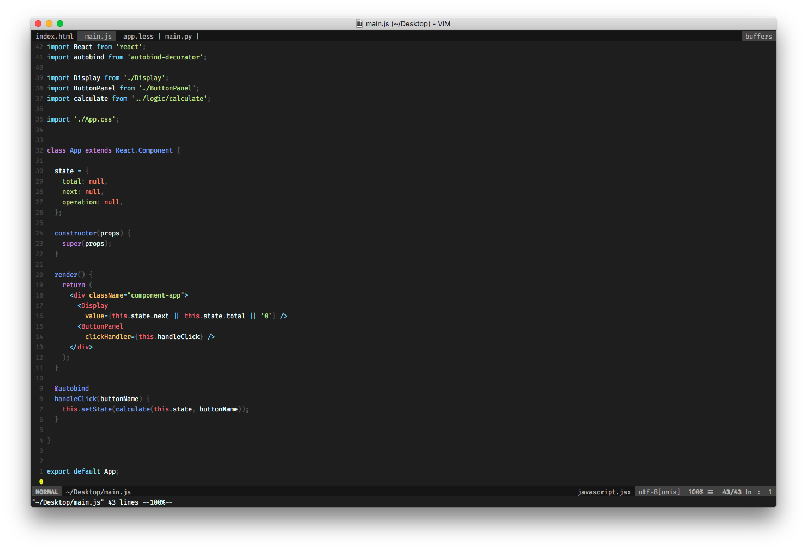
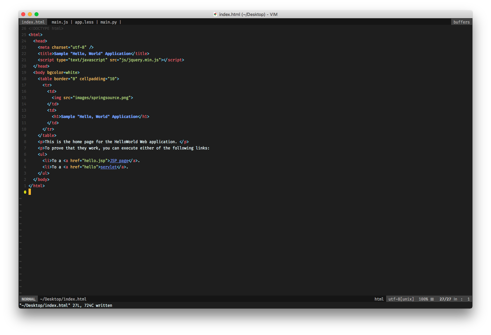
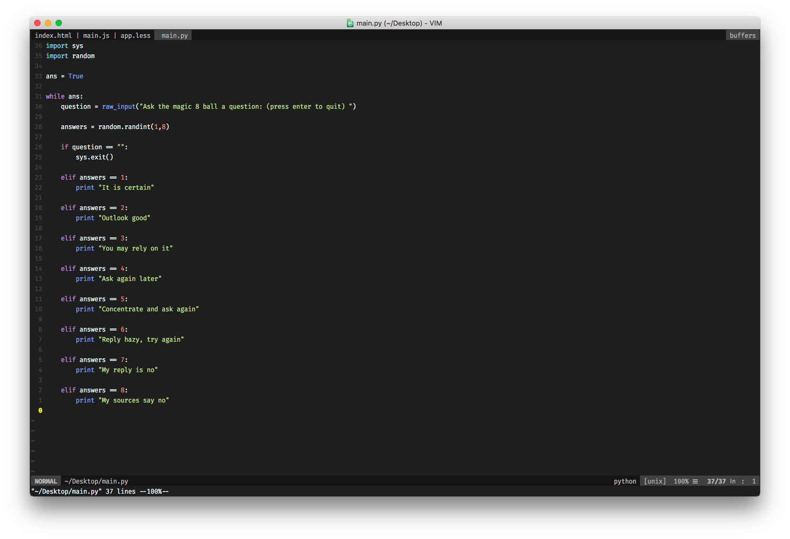
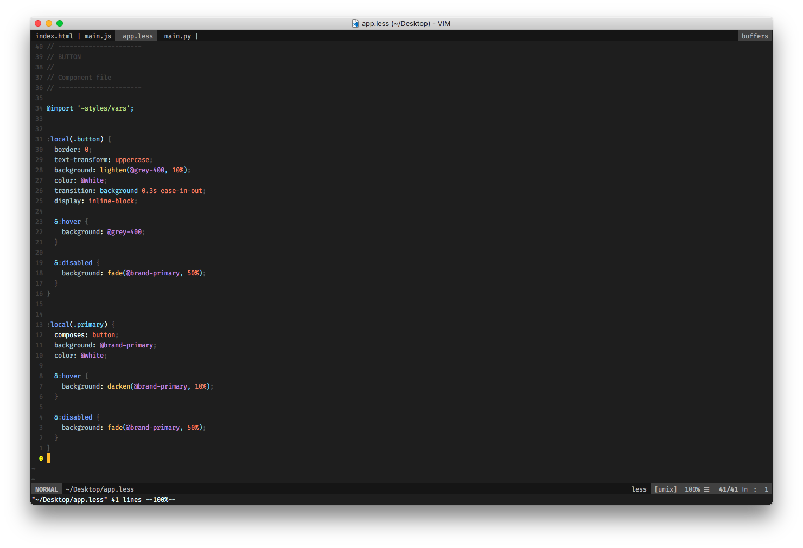

# Vim Vimterial Dark Colorscheme

A dark vim color scheme based on [Material Theme Darker](http://equinusocio.github.io/material-theme).
Improved for web development.

> See also a variation of this color scheme based on atom [vimtom](https://github.com/larsbs/vimtom)

> See also a lighter variation of this color scheme [vimterial](https://github.com/larsbs/vimterial)

## Target Syntax Highlighting Plugins

This theme has been designed with the following syntax highlighting plugins in mind:

 * JavaScript: [pangloss/vim-javascript](http://equinusocio.github.io/material-theme)
 * JSX: [mxw/vim-jsx](https://github.com/mxw/vim-jsx)
 * HTML5: [othree/html5.vim](https://github.com/othree/html5.vim)
 * XML: [larsbs/vim-xmll](https://github.com/larsbs/vim-xmll)
 * Jinja: [Glench/Vim-Jinja2-Syntax](https://github.com/Glench/Vim-Jinja2-Syntax)
 * CSS: [JulesWang/css.vim](https://github.com/JulesWang/css.vim)
 * LESS: [genoma/vim-less](https://github.com/genoma/vim-less)
 * Handlebars: [mustache/vim-mustache-handlebars](https://github.com/mustache/vim-mustache-handlebars)

Support for configure and extend the list of supported syntax highlighting plugins is planned.

> **NOTE:** If you want to add support for a custom syntax highlighting plugin, just fork the repo, create a file under `colors/syntax/{file-type}/{name-of-syntax-plugin}` and then import it in `vimterial_dark.vim`. PRs accepted. See [colors/syntax](colors/syntax) for reference.

## Installation

### Vundle (Recommended)

Installation using [Vundle](https://github.com/VundleVim/Vundle.vim) mentioned for completeness, but it should be similar to the installation of other Vim plugins with whatever installation method you are used to.

Install [Vundle](https://github.com/VundleVim/Vundle.vim) and add this theme as a plugin to your `.vimrc`:

```vim
"...
Plugin 'larsbs/vimterial_dark'
"...
```

Then save the file and run `vim +PluginInstall`


## Screenshots

### Javascript



### HTML



### Python



### LESS


